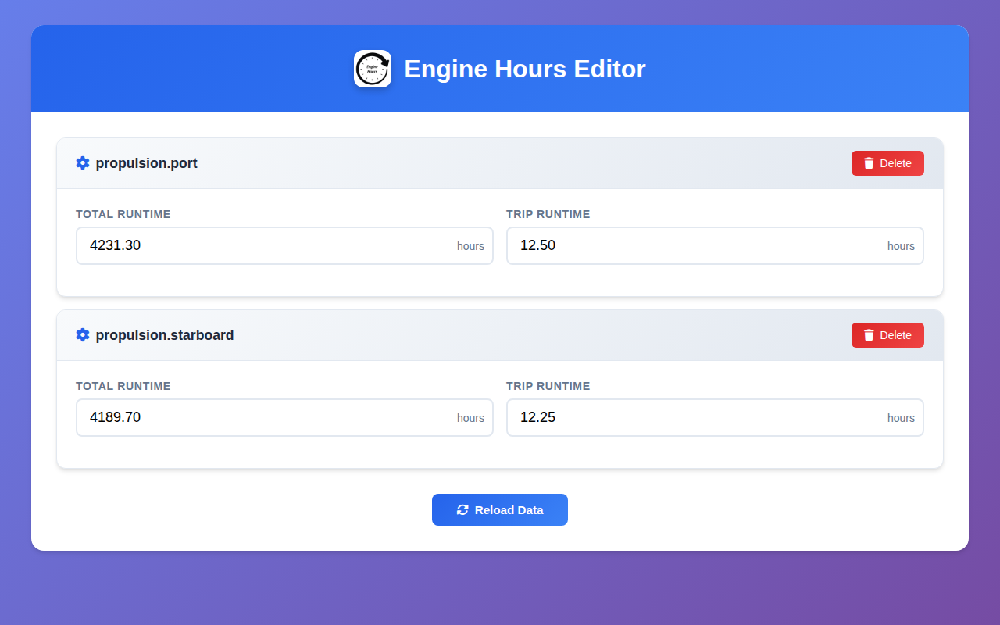

# signalk-engine-hours

Signal K engine hours logger keeps engine runtime data in persistent storage. Engines that report revolutions to the Signal K server are logged automatically. Users can change how often engine revolutions are monitored; the current default is 60s. When the Signal K server starts, previously logged data is read from persistent storage. Runtime data is written to persistent storage shortly after changes (debounced). From the WebApp, engine runtimes can be set and changed.

## Screenshots

## Versions

See [CHANGELOG.md](CHANGELOG.md) for the release history.
